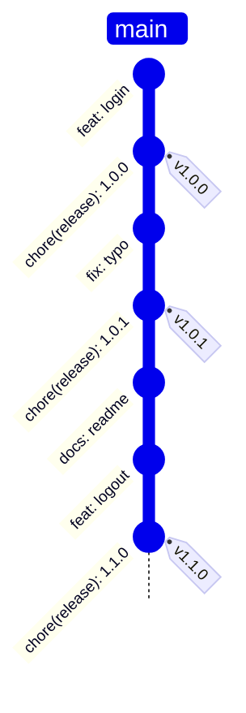
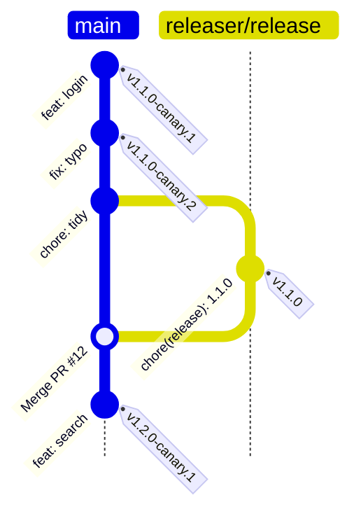
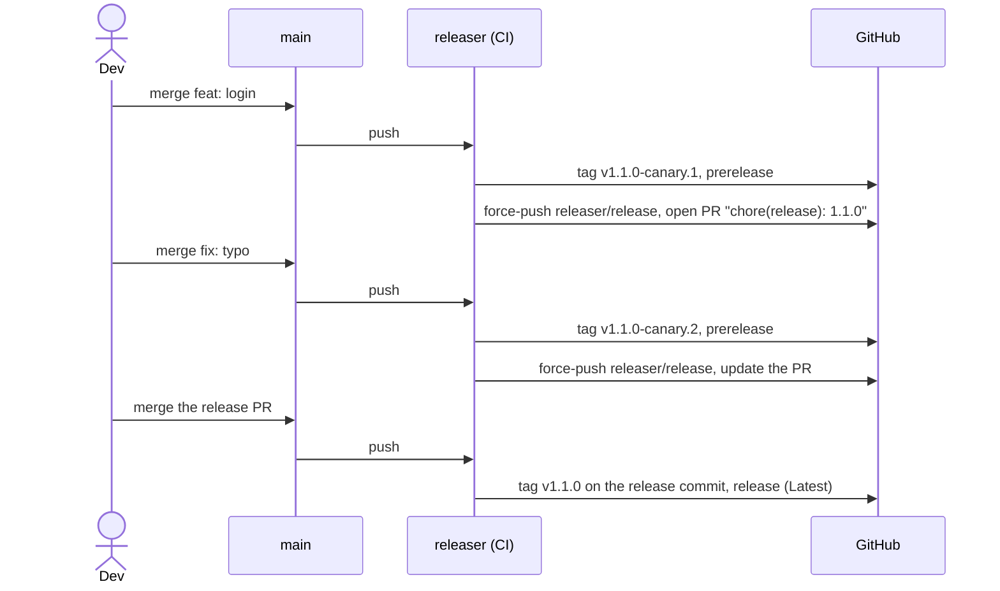
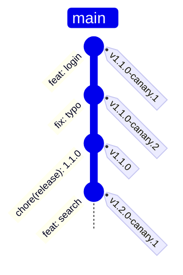
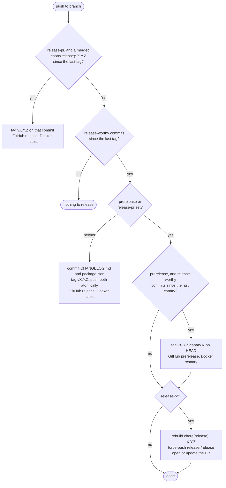

# Release Flows

Two inputs pick how releases reach `main`. Neither is the default.

| Setup                   | Inputs                                   | Every push to `main`                 | Stable release                        |
| ----------------------- | ---------------------------------------- | ------------------------------------ | ------------------------------------- |
| Straight to main        | —                                        | commit + tag `vX.Y.Z`                | that push                             |
| Canary + release PR     | `prerelease: canary`, `release-pr: true` | tag `vX.Y.Z-canary.N`, update the PR | merging the PR                        |
| Canary, manual stable   | `prerelease: canary`                     | tag `vX.Y.Z-canary.N`                | a run without `prerelease` (dispatch) |
| Release PR, no canaries | `release-pr: true`                       | update the PR                        | merging the PR                        |

## Straight to main

Each push with release-worthy commits gets a release commit (`CHANGELOG.md`,
`package.json`, `commit` files) and a tag, pushed together. The commit carries
`[skip ci]`, so it doesn't trigger another run.

`docs: readme` alone releases nothing: `docs` doesn't bump by default (see
[rules](versioning.md#rules)).

## Canary + release PR

`main` never gets a commit from releaser. Each push tags a canary on `HEAD` and
rebuilds the release PR on top of it; merging the PR tags the stable version on
the release commit.

- `chore: tidy` makes no canary: nothing release-worthy since `canary.2`. The PR
  is still rebuilt.
- The graph shows a merge commit. With a squash merge, `v1.1.0` goes on the
  squashed commit on `main` instead; with a rebase merge, on the replayed one.
- `releaser/release` is force-pushed on every push, so the PR always sits on top
  of `main`: it never conflicts and its notes are current.

Setup, token and check details: [Canaries and release PR](trunk.md).

## Canary, manual stable

Canaries as above, no PR. A run without `prerelease` (for example a
`workflow_dispatch` job with the same other inputs) releases straight to main.

That run pushes to `main`, so it needs the same branch protection bypass as
[straight to main](#straight-to-main).

## What one push does

Every push comes last in its box: releases and canaries run `prepare`, artifacts
and Docker `:X.Y.Z` first, the PR runs `prepare` first. A failure leaves the
remote untouched. Docker `:latest` or `:canary` moves after the push.
